# Use Case: Deploying a Production Ready Kubernetes Cluster into AWS and Exposing Cluster Services Via Ingress


This repository was built upon the original kubespray repo which can be found [here](https://github.com/kubernetes-sigs/kubespray). Note that all of the original repository content for deploying onto GCE, Azure, Bare Metal, etc. has been preserved, however I've created this write-up to outline a specific use case for deploying a cluster on AWS and exposing the underlying services to external traffic via ingress. 

This repository is meant to be cloned and run from a local machine. The requirements for the local machine are as follows:

## Requirements:
- **Ansible v2.7.8 (or newer) and python-netaddr installed**
- **Jinja 2.9 (or newer)**
- **Terraform v0.12.16 (or newer)**
- **Additionally, you must own an AWS account**
- **A pre-created EC2 key pair that currently exists in your AWS account**

## Part 1: Deploying Cluster Infrastructure in AWS using Terraform
1. Verify that you have met all the requirements listed above
2. Clone this github repo and change into the directory
```
git clone https://github.com/pchen2145/kubespray
cd kubespray
```
3. Edit the ./contrib/terraform/aws/terraform.tfvars file to your liking. Note that the default values are for an extremely lean cluster (1 master running etcd and 1 worker). You can also change the size of the instances, but be aware that the minimum recommended size for cluster nodes is t2.medium. The cluster in this example is configured to deploy hosts running Ubuntu 16.04.
4. Change into the terraform aws directory and initialize Terraform plugins
```
cd ./contrib/terraform/aws/
terraform init
```
5. Run Terraform apply and review all proposed changes. You will be prompted for your AWS access key ID, region to deploy in, AWS secret access key, and SSH keypair (that you should have pre-created in your AWS account).
```
terraform apply
```
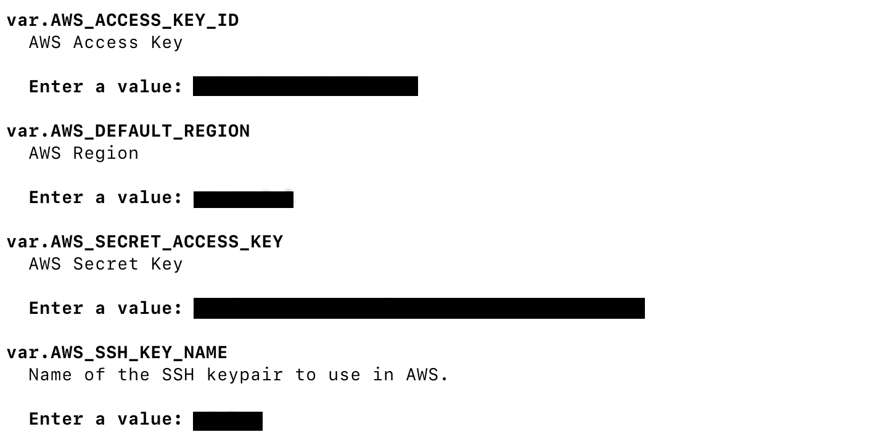

6. Once Terraform has successfully created the infrastructure, you should see an output containing some valuable information about the resources you've created

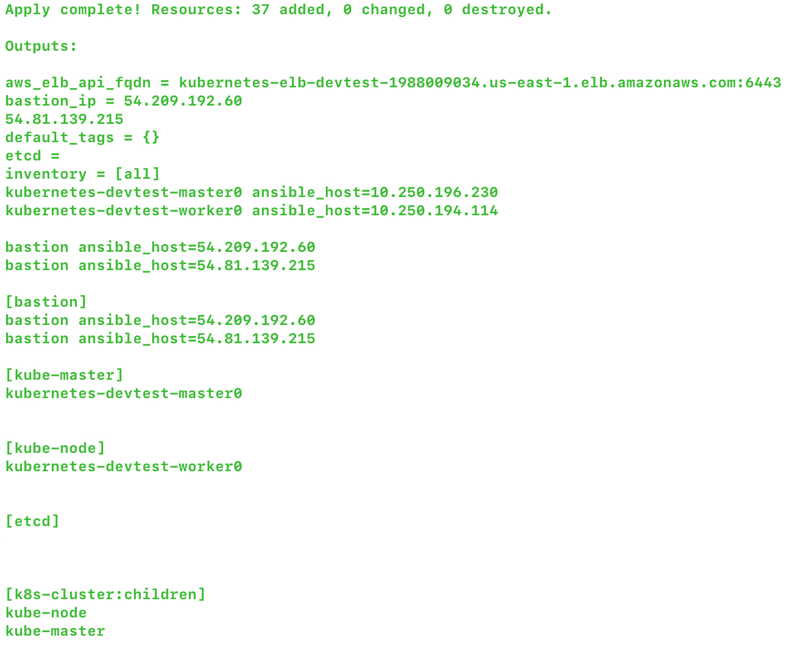

## Part 2: Running Ansible Playbooks to Configure Cluster Nodes and Install Kubernetes 
1. Copy the sample inventory directory. A hosts file should have been generated at the path inventory/hosts. Copy this file into the inventory/mycluster/ directory. 
```
cp ../../..
cp -rfp inventory/sample inventory/mycluster
cp inventory/hosts inventory/mycluster/hosts
```
2. Modify the hostnames of the entries in the hosts file to match the AWS private DNS names of the cluster nodes. These values will be used by the playbooks to identify and find the cluster nodes. One thing to note is that if you do not plan to run etcd on a separate node (depending on your configuration in the terraform.tfvars), you must create an entry under [etcd] and add the private DNS name of the master node to host etcd on the master. If you do not do this step, your cluster will fail.
```
vi inventory/mycluster/hosts
```
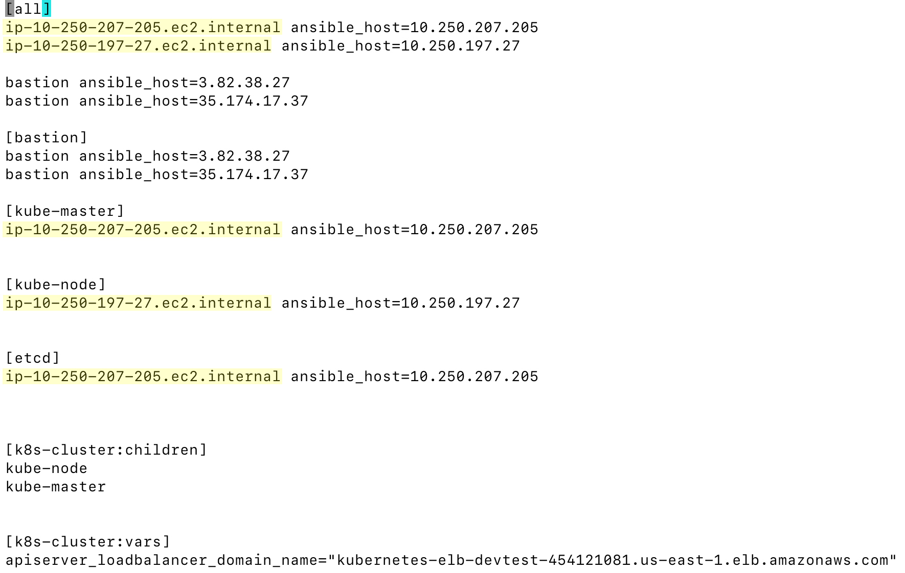

3. Edit the values of ssh-bastion and replace the following yellow fields with your bastion IP address. Replace the green fields with the IPs of your cluster nodes (master, worker, etcd).

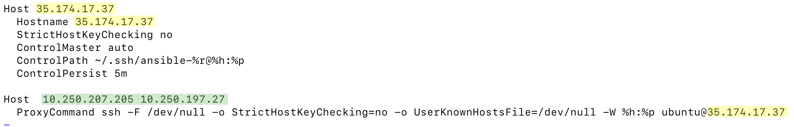

4. Copy or add the contents of the ssh-bastion file to your ~/.ssh/config file. This will allow for ssh key forwarding through the bastion into the private cluster nodes.
```
cp ./ssh-bastion ~/.ssh/config
```
5. Start the ssh agent and add your ssh keypair to the keychain
```
eval `ssh-agent`
ssh-add -K <path-to-your-ssh-keypair>.pem
```
6. Now we're ready to run the playbook! It should take around 10 minutes for the cluster to become ready.
```
ansible-playbook -i inventory/mycluster/hosts ./cluster.yml -e ansible_user=ubuntu -b --become-user=root --flush-cache
```

## Part 3: Finalizing Cluster Setup
1. Ssh into the master node and run the following commands to create the .kube directory and copy over the default generated ./kube/config file
```
ssh ubuntu@<master-node-ip>
mkdir -p $HOME/.kube
sudo cp -i /etc/kubernetes/admin.conf $HOME/.kube/config
sudo chown $(id -u):$(id -g) $HOME/.kube/config
```
2. Verify your cluster. You should be able to see that your nodes are up and accounted for.
```
kubectl get nodes
```

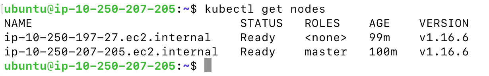

## Part 4: Deploying Containers And Exposing Via Ingress
1. Apply the following files to create some simple pods and services (hashicorp echo and nginx images)
```
kubectl apply -f https://raw.githubusercontent.com/pchen2145/kubespray/master/test-containers/apple.yaml
kubectl apply -f https://raw.githubusercontent.com/pchen2145/kubespray/master/test-containers/banana.yaml
kubectl apply -f https://raw.githubusercontent.com/pchen2145/kubespray/master/test-containers/nginx.yaml
```
2. Verify the pods and services are running
```
kubectl get pods
kubectl get svcs
```

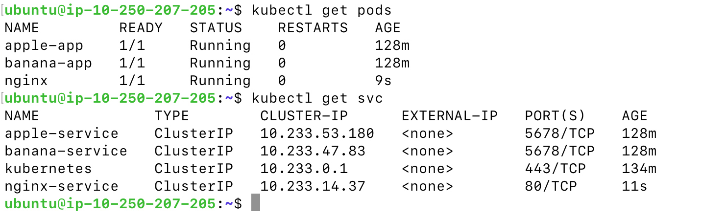

3. Great! All that's left to do is expose these to the outside world by manually creating a load balancer in AWS and then defining ingress rules and applying them to your cluster. Navigate to the AWS console and create a Network Load Balancer (layer 4) that is located in a public subnet. Create a target group that points to all your cluster nodes running ingress-nginx-controller pods. Copy the public DNS of this load balancer, as you will need to refer to it when creating your ingress object.

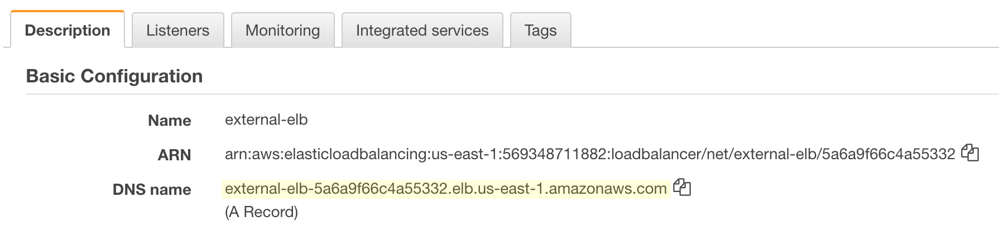

4. Create an ingress definition yaml file with the following contents below and replace the host field value with the DNS name of your newly provisioned load balancer. Apply the file afterwards.  **Optional: If you own a domain name, you could create an alias A record pointing to the load balancer DNS name, and instead use your own domain as the value of the host field.**
```
apiVersion: extensions/v1beta1
kind: Ingress
metadata:
  name: nginx-ingress
  annotations:
    nginx.ingress.kubernetes.io/ssl-redirect: "false"
    nginx.ingress.kubernetes.io/force-ssl-redirect: "false"
    nginx.ingress.kubernetes.io/rewrite-target: /
spec:
  rules:
  - host: external-elb-5a6a9f66c4a55332.elb.us-east-1.amazonaws.com 
    http:
      paths:
      - path: 
        backend:
          serviceName: nginx-service 
          servicePort: 80
      - path: /nginx 
        backend:
          serviceName: nginx-service 
          servicePort: 80
      - path: /apple
        backend:
          serviceName: apple-service 
          servicePort: 5678 
      - path: /banana
        backend:
          serviceName: banana-service 
          servicePort: 5678
```
```
kubectl apply -f ingress.yaml
```

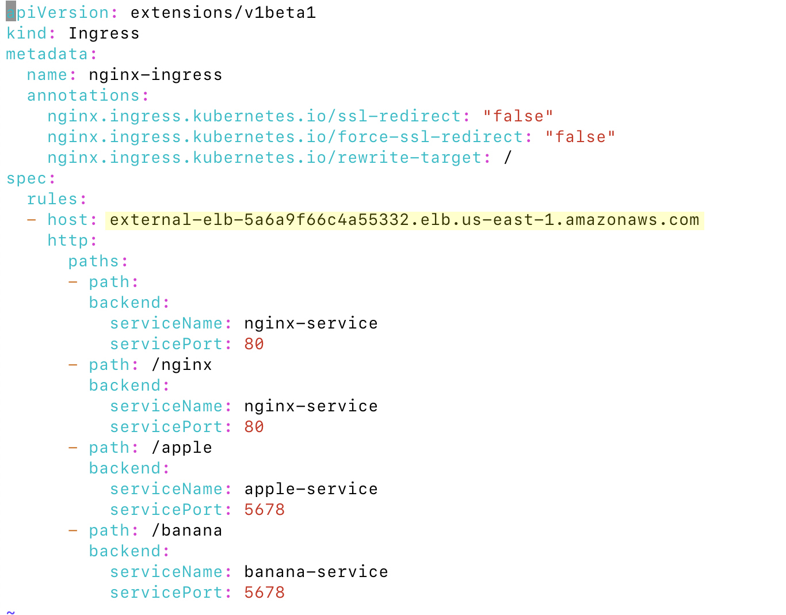

5. Verify it all works by visiting your hostname and appending the various paths!
```
http://external-elb-5a6a9f66c4a55332.elb.us-east-1.amazonaws.com/
http://external-elb-5a6a9f66c4a55332.elb.us-east-1.amazonaws.com/nginx
http://external-elb-5a6a9f66c4a55332.elb.us-east-1.amazonaws.com/apple
http://external-elb-5a6a9f66c4a55332.elb.us-east-1.amazonaws.com/banana
```
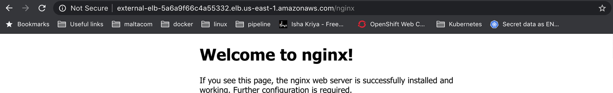

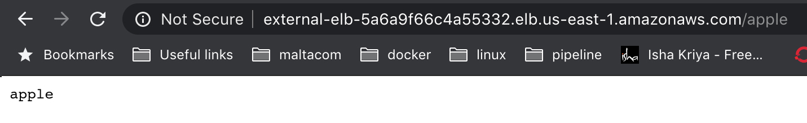

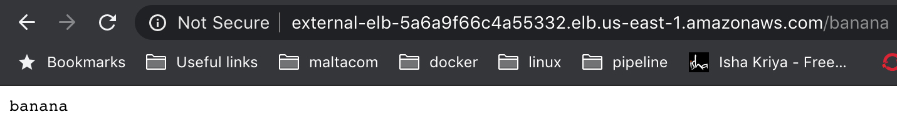

## Part 5: Future Improvements
- Adding TLS between the load balancer and the ingress-controller.
- Experimenting with using other types of load balancers such as EC2 classic.
- Doing additional use case write ups for deploying production ready Kubernetes onto other CSPs such as GCE and Azure.

Thanks for reading!
