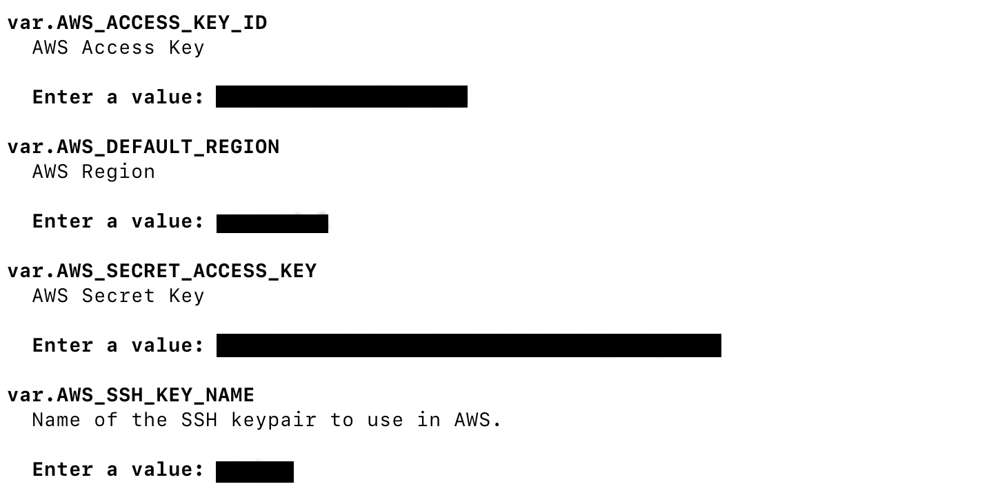
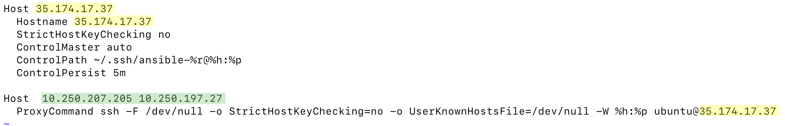

# Use Case: Deploying a Production Ready Kubernetes Cluster into AWS and Exposing Cluster Services Via Ingress


This repository was built upon the original kubespray repo which can be found [here](https://github.com/kubernetes-sigs/kubespray). Note that all of the original repository content for deploying onto GCE, Azure, Bare Metal, etc. has been preserved, however I've created this write-up to outline a specific use case for deploying a cluster on AWS and exposing the underlying services to external traffic via ingress. 

This repository is meant to be cloned and run from a local machine. The requirements for the local machine are as follows:

## Requirements:
- **Ansible v2.7.8 (or newer) and python-netaddr installed**
- **Jinja 2.9 (or newer)**
- **Terraform v0.12.16 (or newer)**
- **Additionally, you must own an AWS account**
- **A pre-created EC2 key pair that currently exists in your AWS account**

## Part 1: Deploying Cluster Infrastructure in AWS using Terraform
1. Verify that you have met all the requirements listed above
2. Clone this github repo and change into the directory
```
git clone https://github.com/pchen2145/kubespray
cd kubespray
```
3. Edit the ./contrib/terraform/aws/terraform.tfvars file to your liking. Note that the default values are for an extremely lean cluster (1 master running etcd and 1 worker). You can also change the size of the instances, but be aware that the minimum recommended size for cluster nodes is t2.medium. The cluster in this example is configured to deploy hosts running Ubuntu 16.04.
4. Change into the terraform aws directory and initialize Terraform plugins
```
cd ./contrib/terraform/aws/
terraform init
```
5. Run Terraform apply and review all proposed changes. You will be prompted for your AWS access key ID, region to deploy in, AWS secret access key, and SSH keypair (that you should have pre-created in your AWS account).
```
terraform apply
```


6. Once Terraform has successfully created the infrastructure, you should see an output containing some valuable information about the resources you've created


## Part 2: Running Ansible Playbooks to Configure Cluster Nodes and Install Kubernetes 
1. A hosts file should have been generated at the path inventory/hosts. Copy this file into the inventory/mycluster/ directory. 
```
cp inventory/hosts inventory/mycluster/hosts.yaml
```
2. Modify the hostnames of the entries in the hosts file to match the AWS private DNS names of the cluster nodes. These values will be used by the playbooks to find the cluster nodes, as they are unreachable via private IP address.
```
vi inventory/mycluster/hosts.yaml
```


3. Edit the values of ssh-bastion.conf and replace the following yellow fields with your bastion IP address. Replace the green fields with the IPs of your cluster nodes (master, worker, etcd).



4. Copy or add the contents of the ssh-bastion.conf file to your ~/.ssh/config file. This will allow for ssh key forwarding through the bastion into the private cluster nodes.
```
cp ./ssh-bastion.conf ~/.ssh/config
```
5. Start the ssh agent and add your ssh keypair to the keychain
```
eval `ssh-agent`
ssh-add -K <your-ssh-keypair-name>.pem
```
6. Now we're ready to run the playbook! It should take around 10 minutes for the playbook to completely run.
```
ansible-playbook -i inventory/mycluster/hosts.yaml ./cluster.yml -e ansible_user=ubuntu -b --become-user=root --flush-cache
```

